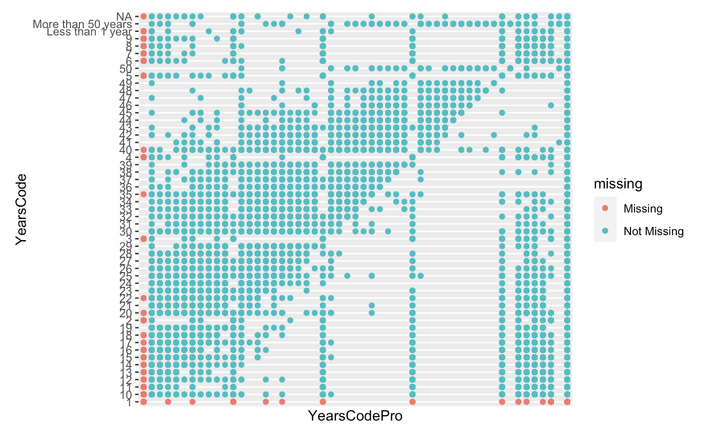
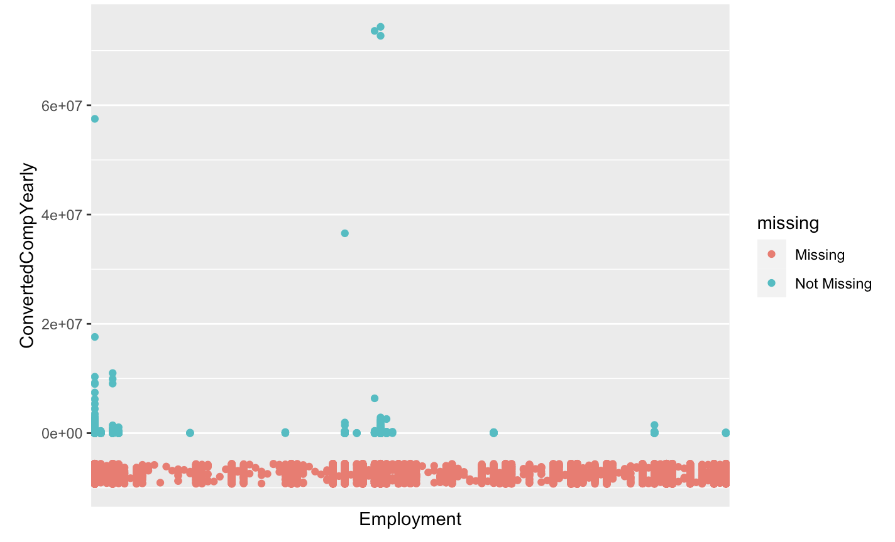
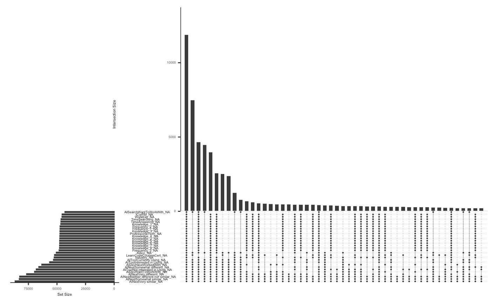
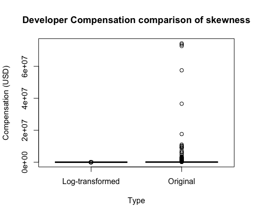
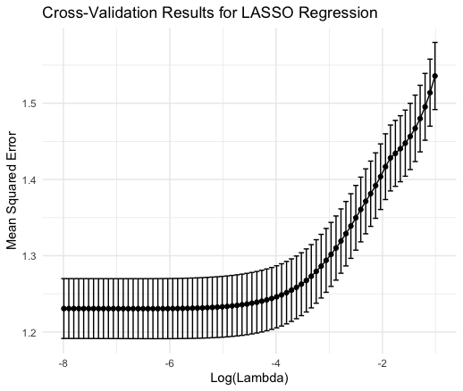
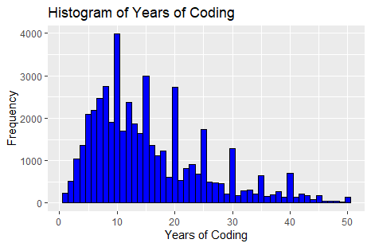
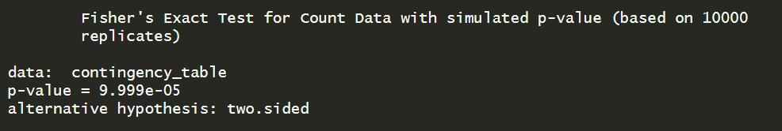
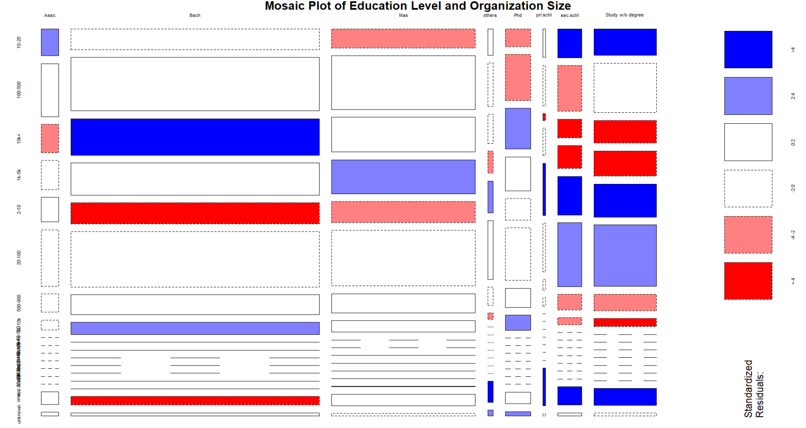
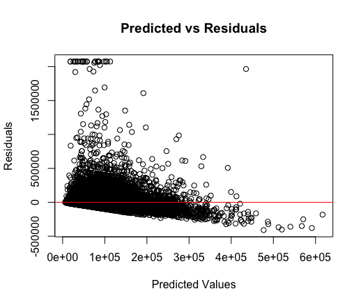

---
output:
  pdf_document:
    latex_engine: xelatex
    keep_tex: true
    number_sections: true
    toc_depth: 3
    fig_caption: true
    fig_crop: true
    highlight: tango
  html_document: default
mainfont: Times New Roman
fontsize: 12pt
geometry: "left=2.54cm,right=2.54cm,top=2.54cm,bottom=2.54cm"
---

```{r setup, include=FALSE}
knitr::opts_chunk$set(echo = TRUE)
```

### Declaration 

We declare that the following project is evidence of our own work that has not been submitted previously for academic credit. All group members, who have all actively contributed, submit this assignment as an original piece of work. 

- Conceptualisation, X.X. and Y.Y.; 
- Methodology, X.X.; 
- Software, X.X.; 
- Validation, X.X., Y.Y. and Z.Z.; 
- Formal Analysis, X.X.; 
- Investigation, X.X.; 
- Resources, X.X.; 
- Data Curation, X.X.; 
- Writing – Original Draft Preparation, X.X.; 
- Writing – Review & Editing, X.X.; 
- Visualisation, X.X.


### Abstract 

This project conducts a comprehensive exploratory data analysis (EDA) of the "Stack Overflow Annual Developer Survey 2023," collecting responses from more than 90,000 developers worldwide. The main aim is to investigate the factors affecting the compensation of developers using various selected determinants.

Our analysis demonstrates important information about developer compensation by exploring the impact of experience, education level, and technological expertise. In conducting our analysis, we used regression models, leveraging the survey's detailed classification and clustering information to calculate the standard errors of the survey estimates accurately. We used graphs to evaluate the relationships between various categorical variables. We detailed our findings and conducted hypothesis testing to evaluate the relationships. Additionally, we addressed nonresponse issues by using multiple imputation techniques to address missing data and ensure robustness in our findings.

This analysis provides insight into compensation dynamics among developers worldwide by addressing critical factors affecting yearly compensation.

### Contents

1. **Declaration**
2. **Abstract**
3. **Introduction**
    - Project Rationale
    - Aim
4. **Data Description**
5. **Survey Methodology**
    - Key Principles
        - Scope and Scale
        - Duration and Timing
    - Survey Design
    - Evaluation of Methodologies
        - Recruitment Methods
        - Geography
        - Adaptive Questionnaire
        - Handling of Compensation Data
        - Technological Inclusion
        - Randomisation of Questions
        - Data Analysis Adjustments
        - Survey Language
    - Non-Response
6. **Data Analysis**
    - Data Description
    - Exploratory Data Analysis (EDA)
    - Data Cleaning and Manipulation
    - Feature Selection and Data Curation
7. **Implementation**
8. **Results**
    - Numerical Response
    - Categorical Response
    - Regression Analysis
9.  **Discussion**
    - Successes
    - Limitations
10. **Conclusion**
11. **References**
12. **Appendix**


### Introduction 

The Stack Overflow Annual Developer Survey 2023 is a comprehensive survey that gathers valuable insights from a large and diverse population of software developers worldwide. The survey covers a wide array of topics, including developer roles, programming languages, tools, frameworks, job satisfaction, career aspirations, demographic characteristics and salaries. With a focus on capturing the evolving developer experience and understanding the impact of emerging technologies like AI/ML on developers' workflows, the survey offers a unique opportunity to investigate the determinants of developer compensation on a global scale.


#### Project Rationale

The tech industry is characterized by rapid advancements and constant change, making it imperative to understand the determinants of developer compensation. The factors that influence compensation have far-reaching implications, not only for individual developers' career trajectories but also for the overall productivity and innovation within organizations. It is therefore vital to study the interplay between the aforementioned factors in determining compensation.

#### Aim

The primary objective of this project is to conduct a detailed exploratory data analysis (EDA) of the Stack Overflow Annual Developer Survey 2023, focusing on understanding the factors that affect developer compensation across the world. We aim to use 'compensation' as the continuous response variable in our regression models to predict compensation based on various predictors such as organisation size, education level, work experience, and role in the industry (developer type). By analysing these, we plan to discover insights into the career paths of developers and the evolving technology landscape, providing valuable information for stakeholders in the tech industry. This analysis will highlight potential fields for the developer community and identify which variables are more influential.


### Data Description 

By collecting the voice of developers, the Stack Overflow Annual Developer Survey 2023 enables analysts, IT leaders, reporters and other developers to stay up to date with the latest trends and technologies that are shaping the industry. The extensive reach and depth of information provided by the survey not only helps provides context in understanding where trends in technology are heading, but also offers key attributes that can potentially influence developer compensation. Through a thorough analysis of this rich dataset, we can gain a deeper understanding of the complex interplay between various variables, such as developer roles, skills, experience, and geographic location, that contribute to determining remuneration in the global tech industry.


The rows within this data set are representative of each respondent who filled out the survey and each column is representative of each question within the survey. As previously identified, there is a large number of missing values as respondents were unable to answer questions based on inability or branching of questions.


### Survey Methodology
\newline
\newline

#### Key Principles
\newline
\newline

**Scope and Scale**: The survey reached 89,184 qualified software developers from 185 countries, indicating a broad global representation. The qualification for analysis was based on respondents' consenting to share their data and the completion of all required questions. Approximately 2,000 responses were excluded due to incomplete data.
\newline
\newline

**Duration and Timing**: The survey was conducted from May 82023, to May 19, 2023. The median response time was nearly 18 minutes, which increased from the previous year due to the inclusion of additional questions.
\newline
\newline
\newline

#### Survey Design
The objective of this survey was to obtain data on a wide range of topics to help infer and provide insights into trends and technology that are shaping the developers industry. The survey contained questions relating to the objective details on the respondents, such as, the years they've spent coding, their salary and their profession. This was combined with questions designed to elicit more subjective responses in relation to the technology landscape, such as, their thoughts on the usefulness of AI to their work and whether Stack Overflow has been helpful. 
\newline

The questionnaire contained a mix of questions in the form of single-response multiple choice, multiple-response multiple choice and short answers that resulted in responses of  categorical or numerical natures. Some multiple choice questions themselves contained response options that related specifically to the questions asked, such as the numerical ranges for employer size. Additionally multiple choice questions utilised Likert scales with the range "Strongly Disagree" to "Strongly Agree", to gauge the agreeableness of a respondent to a proposition, for example, ‘that AI will be useful in assisting their work’. All questions were framed in as neutral a tone as possible to assist in minimising potential social desirability bias from respondents. 
\newline

Survey outcomes from previous years were used as learnings to help update the survey question methodology including the re-evaluation of question wording and framing to reduce ambiguity and non-responses to individual questions.
\newline

The survey mode was conducted in a two-stage process with each stage pertaining to a different form of participation. The initial primary mode of engagement centred around an opt-in model where the survey was available to everyone on the Stack Overflow website. With message banners and advertisements used on the site to encourage users to participate in the survey. The purpose of this model was twofold: to attract as many responses as possible and to reduce the likelihood that individuals who opted-in would provide non-response answers to any individual questions. 
\newline

Once the opt-in time period had elapsed the responses were aggregated by country and a second stage was then implemented, whereby the survey was specifically emailed to a target population of users who had not already completed the survey. The design of this approach involved stratified sampling techniques whereby the target population of users/respondents was weighted according to the country they resided in. To ensure that the overall response rate (opt-in and emailed participants) by country was roughly proportional to number of programmers in that country as a proportion of the global user base. For example, high response rates for countries such as India & China were desired given the disproportionate number of programmers compared to the global mean. As such, should the number of responses be lower than expected at the opt-in stage for these countries, they were over sampled i.e. over represented, in the population of emailed surveys.
\newline
\newline
\newline

#### Evaluation of Methodologies
\newline
\newline

**Recruitment Methods**: Respondents were primarily recruited through Stack Overflow's own channels, such as onsite messaging, blog posts, emails, banner ads, and social media posts. This recruitment strategy likely led to a sample biased towards highly engaged users of Stack Overflow.
\newline
\newline

**Geography**: Due to U.S. sanctions, the survey was not accessible in certain regions (Crimea, Cuba, Iran, North Korea, Syria), potentially skewing geographical representation. Some respondents circumvented this using VPNs, which introduces another layer of bias in data representation.
\newline
\newline

**Adaptive Questionnaire**: The survey employed conditional questioning, where certain topics (e.g., job-related questions) were only presented based on previous responses, which helps in reducing the respondent burden but could lead to biased results if not all relevant respondents see all questions.
\newline
\newline

**Handling of Compensation Data**: Compensation data, which was optional, was provided by 48,026 respondents. Compensation was reported in local currencies and converted to USD using the exchange rate from June 2, 2023. High outlier Compensations were trimmed (less than 1% of data), suggesting robust handling of Compensation data to prevent skewing results.
\newline
\newline

**Technological Inclusion**: Technologies to be included in the survey were selected based on previous years' data and community feedback. This participative approach helped ensure that the survey content remained relevant and reflective of current trends.
\newline
\newline

**Randomisation of Questions**: The survey randomised the order of blocks-of-questions to minimize the order effect. Since the order of questions can influence how they are answered based on their sequence within the survey.
\newline
\newline

**Data Analysis Adjustments**: Post-survey, several corrections were made to the online results. This included adjusting the Compensation filter to exclude small sample sizes and correcting display issues in sections about professional coders and AI tools. This demonstrates an ongoing commitment to accuracy and transparency in reporting survey results.
\newline
\newline

- *Survey Language:* The survey was conducted entirely in English resulting in the possibility of misinterpretation/misunderstanding of the questions asked. Given that the website operates wholly in English, however, the effect of language barrier non-response can be assumed to be minimal.
\newline
\newline
\newline

#### Non-Response
\newline

The survey defined a non-response if either of the following criteria were met:
\newline
- Respondent failed to complete an emailed survey
\newline
- The respondent did not agree to the terms & conditions (Q120)
\newline
\newline

A number of different forms of non-response occurs within this survey as a result of the question composition, distribution methods and respondent locations.
\newline

- *Non-repossession based on branching or skip-logic:* Many questions may be skipped based on the respondent’s answers to previous questions. This is done to streamline the survey, improve the relevance of questions and increase the specific information gathered on respondents. For example, job focused questions would only be visible to those who responded that they had a job, therefore resulting in non-response for all branching questions.
\newline

- *Non-response based on failure to respond when contacted:* A number of participants that were emailed, failed to respond to the survey request despite repeated outreaches.
\newline
\newline

**Non-response rates for The Stack Overflow Annual Developer Survey 2023:**
\newline

40,000 surveys were emailed out to Stack Overflow users, weighted by country and targeted on the most active users that had not already answered. Of these 27,414 were completed with 12,586 non-respondents, resulting in a non-response rate of 31.47%. The unanswered surveys were reissued, using oversampling methodologies to a new sample (n=18,240) that followed the same weighted criteria. Of the 18,240 surveys that were reissued, there were 3,834 respondents and 14,406 non-respondents resulting in a non-response rate of 78.98%. In total, the emailed survey received 31,248 responses against an initial sample size of 40,000 constituting a non-response rate of 21.88%. Combining the total number of emailed surveys, the initial sample + secondary sample = $40,000 + 18,240= 58,240$, therefore the total non-response rate was 46.35%.
\newline
\newline

**Methods to adjust for the non-response:**
\newline

Targeted follow up strategies by way of follow-up communications were employed to encourage non-respondents to complete the survey (Kelly et al., 2013). This included emailing and messaging the non-respondents. After a set time had elapsed, the number of non-respondents was redetermined along with aggregated statistic, specifically geographical location (country)(Corry et al., 2017). An additional round of emailed surveys targeting individuals with the same country characteristics as the non-respondents was conducted along with an oversampling strategy that had a sample size inversely proportional to the initial non-response rate (Pickery & Carton, 2008).


### Data Analysis

#### Data Description
The initial survey data consisted of 84 fields and 89,185 observations. 
The data collected broadly cover four main areas of interest: respondent characteristics, technology, AI and Stack Overflow metrics. The respondent characteristics
outlined details of the respondents including age, employment status, residing country, years coding and salary. The technology element encompassed data about the tools the respondents used as it pertains to programming including the programming languages they know and use, any databases they use, frameworks and platforms they may use and other tangentially related tools such as Confluence. The key topic for this year's developer survey centered around AI and, as such, several questions were asked as to the respondents use of AI and it's effect on their programming. Finally, data was collected around the respondents use of the Stack Overflow website including time spent on the site and what they used it for. Furthermore several questions were asked using a Likert scale to gauge respondents views on the design and usefulness of the site for their needs.

Given that the data set was pre-weighted along the key factor i.e. country and that given the large number of observations in our data-set (89,000+) it was deemed unnecessary for the need to use utilise survey packages as the design effects were likely to be minimal (Heeringa et al., 2017).

In constructing out regression model we selected predictor variables that were likely to have a strong association with the response variable, that is yearly compensation. As such it was determined that variables including the years an individual spent coding, their highest level of education attainment, their role in their organisation, the size of the organisation, the programming languages they know, the database systems they use and other tools they used were the most appropriate. All predictor variables, with the exception of years coding, were categorical and were handled by translating each level into individual binary 1:0 variables corresponding to TRUE/FALSE respectively. 

[Sources]
Heeringa, S. G., West, B. T., & Berglund, P. A. (2017). Applied Survey Data Analysis (2nd ed.)

#### Exploratory Data Analysis (EDA)

A summary of our data indicates that only 4 out of the 84 fields are numeric variables, while the remaining 80 variables are catorgosied as chacters as they are comprised of string responses. It is evident that a number of missing values exist within this dataset as indecates by the number of 'NA's' for the numerical observations.
{width=50% height=50%}

**Numeric Variables**
- CompTotal: Extremely right-skewed given outliers with extermly high compensation values.
- ConvertedCompYearly: Extremely right-skewed given outliers with extermly high compensation values.
- ResponseId: This variable identifies each observation and is not a response from participants.
- WorkExp: Right-skewed, indicating the decreasing frequency of work experience within the respondants. 
- convertedcomp_log: Given the compensation outliers presenet within the dataset, a log transofrmation has been applied to the variable of interest 'ConvertedCompYearly' resultign in an approxiamtly normal distribution. 
{width=50% height=50%}

Further visualations of missing values for key variables of interest:
- There are a random missing values across 'YearsCode' and 'YearsCodePro'.
- Missing values are present across all combinations of 'Employment' types.
- A singular 'Employment' category has a large number of missing values, this is the Non-employed category as those without emplyment have no compensation. 
- It is evident that there is a high amount of non-response questions focuses on compensation, with a number of 'Employment' categories having only missing responses variables. This is on account of the high number of unqiue 'Employment' combinations given the multi-select string nature of the questions and the sensitivity of providing compensation information. 
- No clear trends of missing variables.
{width=50% height=50%}
{width=50% height=50%}


UpSet plots have been used to visualise the intersections of missing data within our dataset, given several characteristics and attribute values can be encoded simultaneously (Lex et al, 2014). This plots indecates that there are higher frequencies for interceptions across all a greater number of variables relating to 'AI' and reduced frequency for interceptions of various reduced combintionas of 'AI' attributes. A large number of misssing values are visibly present within this dataset, therfore requiring appropriate cleaning methodologies.
{width=50% height=50%}


#### Data Cleaning and Manipulation

To clean our data, we first began by subsampling the dataset to include only valid responses to *ConvertedCompYearly*. This decision was made as it maintains a large dataset (48,019 responses) while ensuring data integrity. Additionally due to the highly skewed nature of the data, and *ConvertedCompYearly* being the variable of interest any self-imputation would have been unreliable.

In order to prepare the data for imputation and subsequent regression analyses, several variables required augmentation. The *LanguageHaveWorkedWith* and *DatabaseHaveWorkedWith* variables contained multiple responses per respondent, indicating every language or database they had worked with. These variables were separated and encoded, along with *EdLevel*, *DevType*, and *OrgSize*, to create binary columns representing each unique response.

To handle missing values, we employed Multiple Imputation by Chained Equations (MICE). Five iterations were selected as it gave a balance between computational efficiency and convergence of the algorithm. For the encoded binary variables, the logistic regression method ('logreg') was utilized, for the numeric variable *YearsCode* was imputed using predictive mean matching ('pmm'), this method preserves the distributional properties of the original data (van Buuren, 2007).

The MICE algorithm operates by iteratively imputing missing values in each variable based on the observed values of other variables. By generating multiple imputed datasets, MICE accounts for the uncertainty associated with missing data, providing a more robust and reliable basis for subsequent statistical analyses.

{width=50% height=50%}
The plot shows the mean and standard deviation of the imputed values only. We can see the streams intermingling indicating convergence of the imputed values. 


#### Feature Selection and Data Curation

In analyzing compensation data problems such as skewness and outliers are common. These issues can have detrimental effects on the model. To address this, we performed a log-transformation on the compensation data. The transformation helped to stabilize variance and normalize the data, making it suitable for linear modeling.

The transformation's effectiveness is evident in the boxplot comparison below, which shows a marked reduction in skewness.

{width=50% height=50%}

To identifying the key determinants of *ConvertedCompYearly*, we utilized Lasso regression, a regularization method designed to improve the statistical model's predictive performance and clarity.  Lasso performs both variable selection and regularization, which helps in handling the multicollinearity and overfitting by shrinking less important feature's coefficients to zero. Consequently, Lasso enables us to identify the most pertinent variables while maintaining a parsimonious model.

Our dataset included 135 features, some of which exhibited high multicollinearity. Using Lasso regression, we aimed to mitigate these issues by selecting a subset of features that provides the best predictive performance.

The cross-validation process for Lasso regression involved tuning the lambda parameter, which controls the strength of the penalty applied to features. A plot of the cross-validation results shows how the mean squared error varies with different log(lambda) values. The optimal lambda value in this context was approximately -6.502476 in log space.

{width=50% height=50%}


### Implimentation 

All code and algorithms can be viewed via the GitHub repository (see appendix). 


### Results

#### Numerical Response's Results
- The variable chosen for this part was 'YearsCode'. Here is the histograms:
{width=80% height=80%}
There is a noticeable peak in the distribution at 5 to 10 years of coding experience, indicating that a high percentage of persons in our sample have coding expertise in this area. This might mean that many people are in the early to mid stages of their careers. The frequency drops as the number of years increases, as is common in many job domains where fewer people achieve very high levels of expertise. The existence of numerous peaks (10, 15, 20, 30 years) may reflect varied common career duration or moments at which people change occupations, rise to new roles, or even take pauses from coding. The histogram includes a big tail to the right, indicating that there are still a considerable number of people with extensive coding expertise, but far less than those with 5-10 years.
**Summary Statistics:**
**Mean of Years of Coding: 15.67**
**Standard Deviation of Years of Coding: 9.87**
**Median of Years of Coding: 13**
The dataset includes around 15.67 average years of coding experience. The mean is sensitive to outliers and skewed distributions, which means that a few extremely high or low numbers can have a large impact on the mean. A standard deviation of around 9.87 years implies that individual coding experience varies greatly from the average (mean), with many developers having years of expertise that are significantly lower or higher than the norm. The median is a reliable measure of central tendency that is less impacted by outliers and skewed data than the mean. This number is less than the mean, indicating that the distribution of years of coding is somewhat skewed to the right (positively skewed), with a tail extending towards greater years of coding.


#### Categorical Response's Results
- Two categorical variable: "Education Level" and "Organisation size" has been chosen to observe if there is any association among them. For this hypothesis test, a Fisher Exact Test has been deployed. The p-value is derived from a simulation method rather than an exact calculation based on 10,000 replicates. This simulation method is conducted due to the small expected frequencies in the contingency table, making exact calculations impractical. The alternative hypothesis of this test is two-sided, indicating that it was examining any potential correlation between the variables, without assuming that one variable is greater or lesser than the other.
{width=100% height=100%}
Using Fisher's Exact Test with 10,000 simulated repetitions, we established a very significant connection between the two categorical variables under study (p <0.0001). This implies that the observed link is highly unlikely to have occurred by coincidence, providing compelling evidence against the null hypothesis of no association. This conclusion might have significant consequences for our understanding of education level and organisation size. The robustness of this result is reinforced by the use of a simulation technique to account for the contingency table's particular conditions.

{width=100% height=100%}

The relationship between organisation sizes and education levels is comprehensively visualised using the mosaic plot. Different education levels are represented on the X-axis, and organisational sizes are represented on the Y-axis. The size of the tiles in the mosaic plot represents the frequency or proportion of combinations of education level and organisation size. Each tile represents a combination of these attributes. The standardised residuals, which show the degree of association between these categories, are indicated by the colour coding of the tiles, which ranges from blue to red. Red tiles indicate lower-than-expected frequencies, and blue tiles indicate higher-than-expected frequencies. The colour's intensity corresponds to the size of these residuals.

Several important insights are revealed by a thorough plot analysis. For developers who possess a bachelor's degree (as shown by the larger blue tiles), there is a noticeably higher proportion in smaller organisations. On the other hand, as indicated by the red tiles, employees with bachelor's degrees tend to be less common than anticipated in larger organisations. Workers who hold master's degrees are more common in medium-sized to large-sized businesses; these positive residuals are highlighted by blue tiles. The red tiles indicate that employees with master's degrees are less common in smaller organisations.

In a similar vein, employees with professional degrees are more common in larger organisations, although the frequency of such employees is lower in smaller organisations. The trend for developers holding associate's degrees is less obvious; medium-sized organisations nevertheless exhibit a somewhat higher frequency than anticipated.

With only slight differences, the proportion of employees who have only completed their primary or elementary and secondary schooling is generally low across all organisation sizes. The blue tiles indicate the higher frequency of employees in smaller organisations who have some college education but have not earned a degree, while the red tiles indicate the lower frequency of such employees in larger organisations.

In conclusion, the mosaic plot shows that while smaller organisations have a more diverse range of education levels, including bachelor's degrees and some college education without degrees, larger organisations prefer employees with higher education levels, such as master's and professional degrees. The standardised residuals provide important information about the hiring practices of various organisation sizes by highlighting the significant relationships between education levels and organisation sizes


#### Regression Results

{width=50% height=50%}

The Predicted vs Residuals plot displays residuals on the vertical axis and the predicted compensation values on the horizontal axis. A horizontal line at zero represents no error between the predicted and actual values. The ideal scenario in such a plot is for the residuals to be randomly dispersed around the horizontal line, indicating that the model predicts equally well across all values of the independent variable. As can be observed, the spread of residuals increases with the predicted compensation values. The heteroscedasticity observed suggests that the model's predictive accuracy varies across the scale of compensation, being less precise at higher compensation levels. This violates one of the fundamental assumptions of linear regression, so further results should be treated with caution.


**Model Performance**

The Mean Squared Error of the model was found to be approximately 464,518,156,488. This high value suggests that the model may have limitations in capturing all the variability in the compensation data. The R-squared value was -0.0004, indicating that the model explains none of the variability around the mean. This unexpectedly low value could be a result of non-linear relationships not captured by the model.

The top predictors determined by the Lasso of developer compensation include:

<<<<<<< HEAD
- Student: Coefficient: -1.15, 95% CI: [-1.30, -1.00]. Suggests that attaining education can have a negative impact on compensation.
- APL: Coefficient: -0.53, 95% CI: [-0.65, -0.41]. Suggests that less mainstream technologies may correlate with lower pay.
- Academic Researcher: Coefficient: -0.31, 95% CI: [-0.42, -0.196]. Indicates lower compensation in academic roles.
- Primary/Elementary School: Coefficient: -0.17, 95% CI: [-0.336, 0.0]. Suggests lower compensation for lower educational attainment.
- Senior Executive (C-Suite, VP, etc.): Coefficient: 0.28, 95% CI: [0.194, 0.368]. Senior positions result in higher compensation.
=======
- Student: Coefficient: -1.15, 95% CI: [-1.30, -1.00]. This indicates that being a student is associated with lower compensation, possibly due to part-time or intern-level employment.
- APL: Coefficient: -0.53, 95% CI: [-0.65, -0.41]. Suggests less mainstream technologies may correlate with lower pay. 
- Academic Researcher: Coefficient: -0.31, 95% CI: [-0.42, -0.196]. Indicating lower compensation in academic roles. 
- Primary/Elementary School: Coefficient: -0.17, 95% CI: [-0.336, 0.0]. Suggests lower compensation for lower educational attainment.
- Senior Executive (C-Suite, VP, etc.): Coefficient 0.28, 95% CI: [0.194, 0.368]. Senior positions result in higher compensation.
>>>>>>> 719f21b1e349363028cf2c8cfac4788ad2405343
- Raku: Coefficient: -0.37, 95% CI: [-0.49, -0.25]. Similar to APL, using less common technologies correlates with lower compensation.
- Company size showed that large companies compensate better than small companies, with large companies having a positive coefficient (Coefficient: 0.34, 95% CI: [0.294, 0.381]) and small companies a negative coefficient (Coefficient: -0.32, 95% CI: [-0.367, -0.263]).
- Blockchain (Coefficient: 0.05, 95% CI: [0.0, 0.1]) and Snowflake (Coefficient: 0.31, 95% CI: [0.263, 0.357]): These technologies are associated with higher compensation, likely reflecting their current demand and the specialization required.

The Lasso model has provided valuable insights into the factors affecting developer compensation, highlighting the role of job roles, technology use, and company size. However, the low R-squared value suggests that additional variables, possibly capturing more specific skills or regional economic factors, might be needed to improve the model's explanatory power. Further analysis could also explore non-linear modeling techniques or more sophisticated transformations to better capture the complex dynamics of the compensation landscape in tech.

### Discussion 


#### Successes
The data for the analysis we conducted was challenging to process due to a significant amount of missing values. Our most significant success was using the Multiple Imputation with Chained Equations (MICE) algorithm to handle missing values, which we did satisfactorily. By using five iterations, we ensured that our data was balanced. Successful implementation of the MICE algorithm ensured that the imputed data sets were reliable and robust, providing a solid foundation for subsequent analysis. So, we encountered convergence issues in our data and ensured that model parameters were stable and gave accurate and reliable results.

In addition, we effectively handled the data cleaning and manipulation process. Due to the highly skewed structure of the *ConvertedCompYearly* variable, which we chose as the response variable, performing an analysis in its raw form would not allow us to obtain accurate results. Maintaining a large dataset of 48,019 responses while ensuring data integrity, we began *ConvertedCompYearly* by subsampling the dataset to include only valid responses. Through this careful data preparation and the application of statistical methods detailed above, we successfully prepared the data for accurate and meaningful analysis.

#### Limitations
Although the research is comprehensive and informative, it also comes with some limitations that should be considered when interpreting the results. Firstly, the survey is not fully randomized; it mostly targets users who are active on Stack Overflow. This method of surveying through Stack Overflow's own channels, such as onsite messaging, blog posts, and emails, can be limiting. Additionally, only two rounds of survey sending may include a limited variety of respondents.

Another important consideration is that the salary question was optional, and 48,026 respondents provided salary data. This means that nearly half of the participants chose not to give this information. Different factors can lead to this, such as the sensitivity of salary data in some countries and cultures, or individuals not feeling comfortable sharing their earnings, especially if they are dissatisfied with them.

Data privacy and security are also critical concerns. Due to worries about declaring sensitive information, participants may hesitate to share detailed personal data. The sensitivity of the information, the people who have or can access the information, and the security solutions can be concepts that stop people. In today's digital world, concerns about personal information breaches can significantly affect participation rates.

To ensure data consistency, salary data provided by the participant was converted to US dollars using the exchange rate on June 2, 2023. However, this conversion may lead to biases. Economic conditions can differ between countries, so an individual earning a good salary by their country's standards might fall into a different income category after conversion to USD. This could lead to incorrect findings when making country-based inferences. 


### Conclusion 

The Stack Overflow Annual Developer Survey 2023 is a noteworthy dataset that offers valuable insights into developer compensation trends and their factors. 

Our results indicate that not only does education and company size impact compensation but specific technologies that are both widely used, and in-demand drive increased compensation values. This is in alignment with the economic theory of supply and demand, in which compensation increases when there is a greater amount of demand to supply. To obtain more accurate results, further analysis is required with a higher degree of granularity for elements related to compensation and the possible application of non-linear models. Considering that many survey items were optional, this will lead to a deeper comprehension of the effects on compensation. 

The Stack Overflow Developer Survey for 2023 has provided valuable insights into understanding compensation of developers across the world. This report has addressed a number of data challenges including the non-response to identify the relationships of key variables that impact developer compensation. Further research may deepen our understanding of factors that may influence the future of developers as they grow, learn and adjust to new trends and technologies in the rapidly evolving industry. This analysis does not only benefit developers but may be used by employers and policymakers to improve their understanding of the compensation landscape for developers and address disparities across the industry. 


### References 

Corry, N.H., Williams, C.S., Battaglia, M., McMaster, H.S., Stander, V.A., (2017), Assessing and adjusting for non-response in the Millennium Cohort Family Study. *BMC Med Res Methodol*, 17(16). https://doi.org/10.1186/s12874-017-0294-8
\newline
Heeringa, S. G., West, B. T., & Berglund, P. A. (2017). Applied Survey Data Analysis (2nd ed.)
\newline
Kelly K, CLARK B, Brown V,Sitzia J. (2003). Good practice in the conduct and reporting of survey research, *International Journal for Quality in Health Care*, 15(3), 261–266, https://doi.org/10.1093/intqhc/mzg031
\newline
Lex, A., Gehlenborg, N., Strobelt, H., Vuillemot, R., & Pfister, H. (1983–1992). UpSet: Visualization of Intersecting Sets. *IEEE transactions on visualization and computer graphics*, 20(12), https://doi.org/10.1109/TVCG.2014.2346248
\newline
Pickery, J., & Carton, A. (2008). Oversampling in Relation to Differential Regional Response Rates. *Survey Research Methods*, 2(2), 83–92. https://doi.org/10.18148/srm/2008.v2i2.656
\newline
van Buuren S. (2007). Multiple imputation of discrete and continuous data by fully conditional specification. *Statistical methods in medical research*, 16(3), 219–242. https://doi.org/10.1177/0962280206074463


### Appendix

[Insert link to repository](https://github.com/JohnBenson-macq/STAT8101_Group_Assignment)


