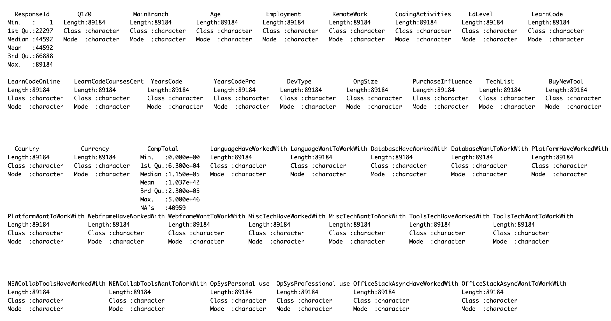
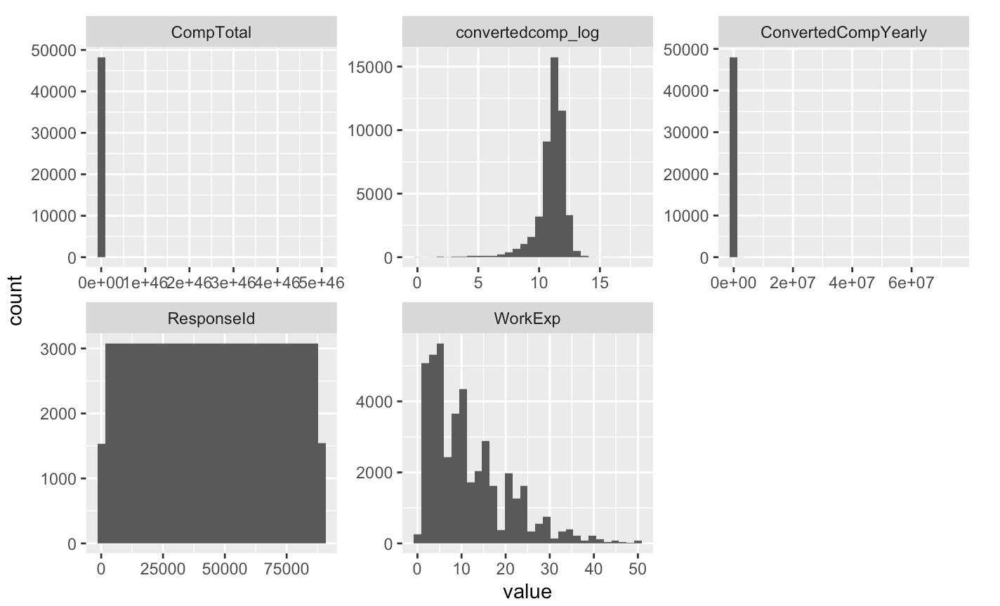
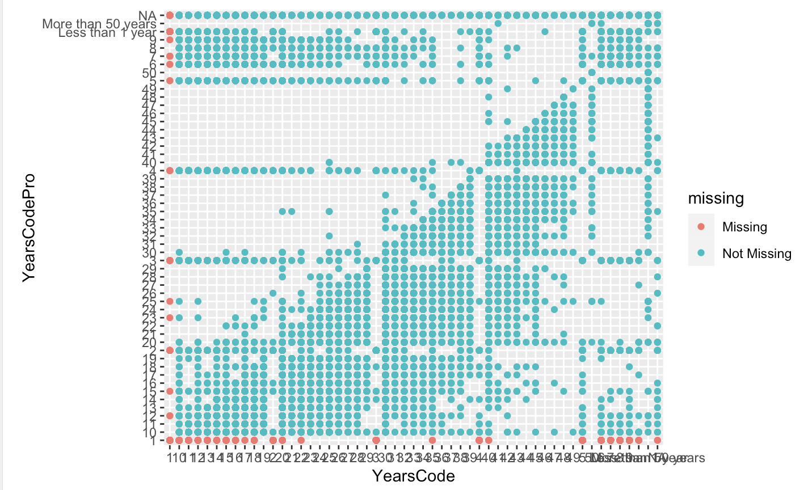
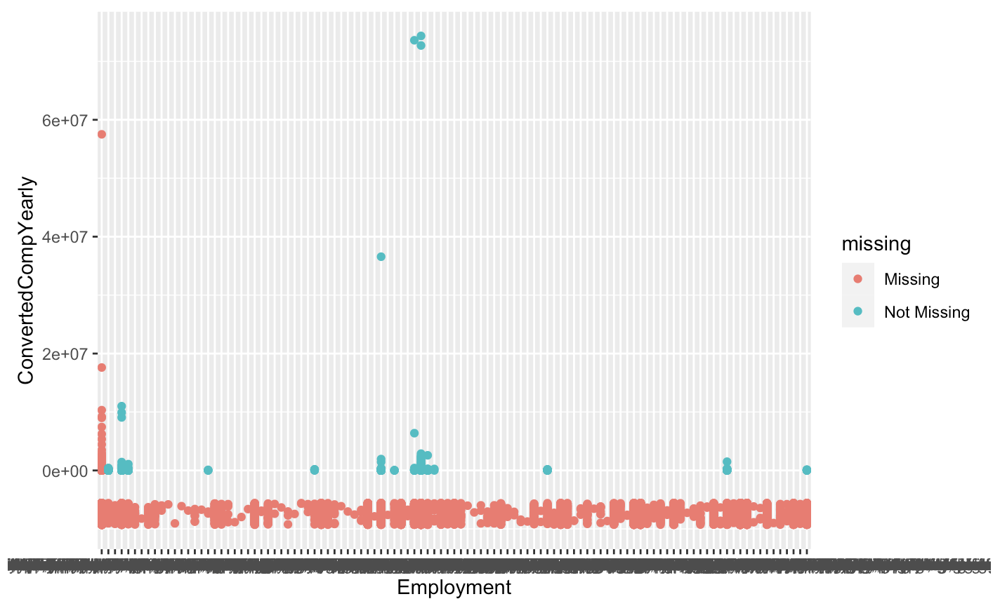
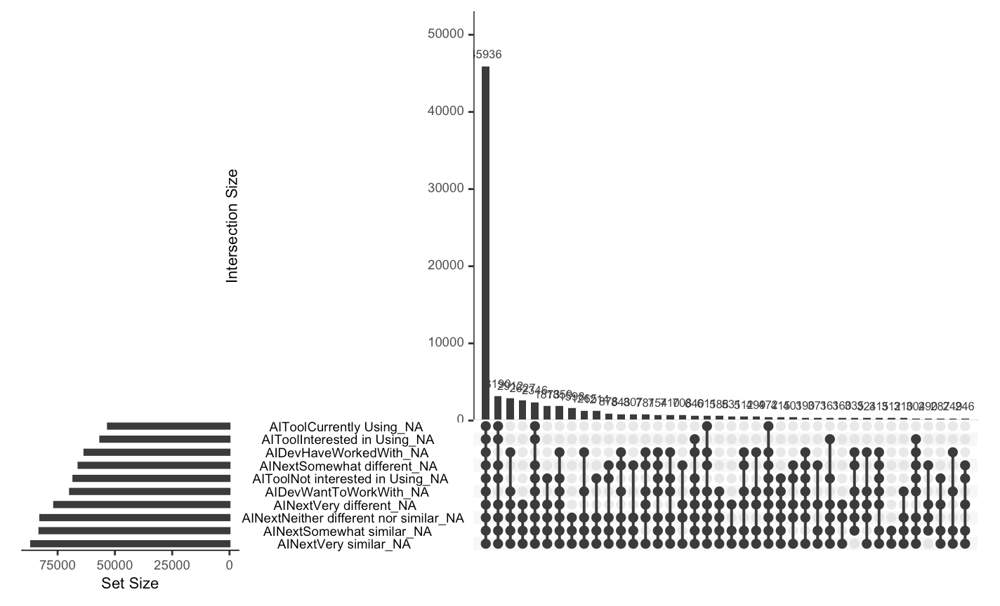
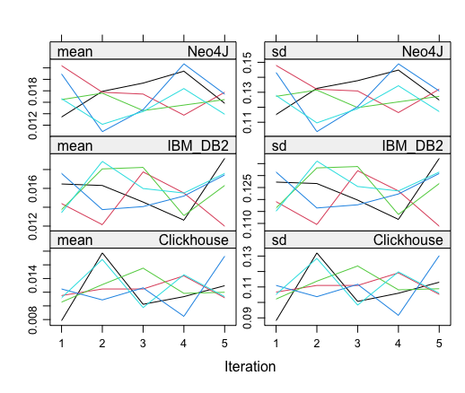

---
output:
  pdf_document:
    latex_engine: xelatex
    keep_tex: true
    number_sections: true
    toc_depth: 3
    fig_caption: true
    fig_crop: true
    highlight: tango
  html_document: default
mainfont: Times New Roman
fontsize: 12pt
geometry: "left=2.54cm,right=2.54cm,top=2.54cm,bottom=2.54cm"
---

```{r setup, include=FALSE}
knitr::opts_chunk$set(echo = TRUE)
```

### Declaration 

We declare that the following project is evidence our own work that has not been submitted previously for academic credit. All group members, who have all actively contributed, submit this assignment as an original piece of work. 

- Conceptualisation, X.X. and Y.Y.; 
- Methodology, X.X.; 
- Software, X.X.; 
- Validation, X.X., Y.Y. and Z.Z.; 
- Formal Analysis, X.X.; 
- Investigation, X.X.; 
- Resources, X.X.; 
- Data Curation, X.X.; 
- Writing – Original Draft Preparation, X.X.; 
- Writing – Review & Editing, X.X.; 
- Visualisation, X.X.


### Abstract 

This project conducts a comprehensive exploratory data analysis (EDA) of the "Stack Overflow Annual Developer Survey 2023," collecting responses from more than 90,000 developers worldwide. The main aim is to investigate the factors affecting the compensation of developers using various selected determinants.

Our analysis demonstrates important information about developer compensations by exploring the impact of experience, education level, and technological expertise. In conducting my analysis, we used regression models, leveraging the survey's detailed classification and clustering information to calculate the standard errors of the survey estimates accurately. We used graphs to evaluate the relationships between various categorical variables. We detailed our findings and conducted hypothesis testing to evaluate the relationships. Additionally, we addressed nonresponse issues by using multiple imputation techniques to address missing data and ensure robustness in our findings.

This analysis provides insight into compensation dynamics within developers worldwide by addressing critical factors affecting yearly compensation.

### Contents

1. **Declaration**
2. **Abstract**
3. **Introduction**
    - Project Rationale
    - Aim
4. **Data Description**
5. **Survey Methodology**
    - Key Principles
        - Scope and Scale
        - Duration and Timing
        - Survey Design
        - Stratification and Clustering
    - Evaluation
        - Recruitment Methods
        - Geography
        - Adaptive Questionnaire
        - Handling of Compensation Data
        - Technological Inclusion
        - Randomization of Questions
        - Data Analysis Adjustments
        - Non-response
6. **Data Analysis**
    - Data Description
    - Exploratory Data Analysis (EDA)
        - Descriptive Statistics
        - Histograms and Graphs
    - Data Cleaning and Manipulation
    - Feature Selection/Data Curation
    - Regression Analysis
7. **Discussion**
    - Summary of Results
    - Successes
    - Limitations
8. **Conclusion**
9. **References**
10. **Appendices**


### Introduction 

The Stack Overflow Annual Developer Survey 2023 is a comprehensive survey that gathers valuable insights from a large and diverse population of software developers worldwide. The survey covers a wide array of topics, including developer roles, programming languages, tools, frameworks, job satisfaction, career aspirations, demographic characteristics and salaries. With a focus on capturing the evolving developer experience and understanding the impact of emerging technologies like AI/ML on developers' workflows, the survey offers a unique opportunity to investigate the determinants of developer compensation on a global scale.


#### Project Rationale

The tech industry is characterized by rapid advancements and constant change, making it imperative to understand the determinants of developer compensation. The factors that influence compensation have far-reaching implications, not only for individual developers' career trajectories but also for the overall productivity and innovation within organizations. It is therefore vital to study the interplay between the aforementioned factors in determining compensation.

#### Aim

The primary objective of this project is to conduct a detailed exploratory data analysis (EDA) of the Stack Overflow Annual Developer Survey 2023, focusing on understanding the factors that affect developer compensation across the world. We aim to use 'compensation' as the continuous response variable in our regression models to predict compensation based on various predictors such as organisation size, education level, work experience, and role in the industry (developer type). By analysing these, we plan to discover insights into the career paths of developers and the evolving technology landscape, providing valuable information for stakeholders in the tech industry. This analysis will highlight potential fields for the developer community and identify which variables are more influential.


### Data Description 

By collecting the voice of developers, the Stack Overflow Annual Developer Survey 2023 enables analysts, IT leaders, reporters and other developers to stay up to date with the latest trends and technologies that are shaping the industry. The extensive reach and depth of information provided by the survey not only helps and provides context in understanding where trends in technology are heading, but also offers key attributes that can potentially influence developer compensation. Through a thorough analysis of this rich dataset, we can gain a deeper understanding of the complex interplay between various variables, such as developer roles, skills, experience, and geographic location, that contribute to determining remuneration in the global tech industry.


The rows within this data set are representative of each respondent who filled out the survey and each column is representative of each question within the survey. As previously identified, there is a large number of missing values as respondents were unable to answer questions based on inability or branching of questions. These value have been dealt with xx as required by the objective xx. 


### Survey Methodology

#### Key Principles

- **Scope and Scale**: The survey reached 89,184 qualified software developers from 185 countries, indicating a broad global representation. The qualification for analysis was based on respondents' consent to share their data and completion of all required questions. About 2,000 responses were excluded due to incomplete data.

- **Duration and Timing**: The survey was conducted from May 8, 2023, to May 19, 2023. The median response time was nearly 18 minutes, which increased from the previous year due to the inclusion of additional questions this year.

#### Survey Design
- **Survey Design**: 


- **Stratification and Clustering**: 
- was not an SRS, there was stratifcation but not clsutering (from survey desing)
- 

#### Evaluation of Methodologies

- **Recruitment Methods**: Respondents were primarily recruited through Stack Overflow's own channels, such as onsite messaging, blog posts, emails, banner ads, and social media posts. This recruitment strategy likely led to a sample biased towards highly engaged users of Stack Overflow.

- **Geography**: Due to U.S. sanctions, the survey was not accessible in certain regions (Crimea, Cuba, Iran, North Korea, Syria), potentially skewing geographical representation. Some respondents circumvented this using VPNs, which introduces another layer of bias in data representation.

- **Adaptive Questionnaire**: The survey employed conditional questioning, where certain topics (e.g., job-related questions) were only presented based on previous responses, which helps in reducing the respondent burden but could lead to biased results if not all relevant respondents see all questions.

- **Handling of Compensation Data**: Compensation data, which was optional, was provided by 48,026 respondents. Compensation were reported in local currencies and converted to USD using the exchange rate from June 2, 2023. High outlier Compensation were trimmed (less than 1% of data), suggesting robust handling of Compensation data to prevent skewing results.

- **Technological Inclusion**: Technologies to be included in the survey were selected based on previous years' data and community feedback. This participative approach helped ensure that the survey content remained relevant and reflective of current trends.

- **Randomization of Questions**: The survey randomized the order of blocks of questions to minimize the order effect, which can influence how questions are answered based on their sequence in the survey.

- **Data Analysis Adjustments**: Post-survey, several corrections were made to the online results, such as adjusting the Compensation filter to exclude small sample sizes and correcting display issues in sections about professional coders and AI tools. This demonstrates an ongoing commitment to accuracy and transparency in reporting survey results.

- **Non-response**: 
A variety of different forms of non-response occurs within this survey as a result of the questions composition, distribution methods and respondent locations. 

- Non-repossession based on branching or skip-logic: Many questions are skipped based on the respondents answers to previous questions. This is done to streamline the survey, improve the relevance of questions and increase the specif information gathered on respondents. For example, job focused questions would only be visible to those who responded that they had a job, therefore resulting in non-response for all branching questions.
- Non-response based on failure to respond when contacted: A number of participants that were emailed, failed to respond to the survey request despite repeated outreaches.
- The survey was conducted entirely in English resulting in the possibility of misinterpretation/misunderstanding of the questions asked. Given that the website operates wholly in English, however, the effect of language barrier non-response can be assumed to be minimal.
- The survey was conducted solely in English, which could lead to potential misinterpretations or misunderstandings of the questions. However, since the website operates exclusively in English, the impact of non-response due to language barriers is expected to be minimal.
\newline
\newline
\newline
The survey defined a non-response if either of the following criteria were met:
- Respondent failed to complete an emailed survey
- The respondent did not agree to the terms & conditions (Q120)
\newline
Non-response rates for The Stack Overflow Annual Developer Survey 2023:
40,000 surveys were emailed out to Stack Overflow uses weighted by country and targeted on the most active users that had not already answered. Of these 27,414 were completed with 12,586 non-respondents, resulting in a non-response rate of 31.47%. The unanswered surveys were reissued, using oversampling methodologies to a new sample (n=18,240) that followed the same weighted criteria. Of the 18,240 survey that were reissued there were 3,834 respondents and 14,406 non-respondents resulting in a non-response rate of 78.98%. In total, the emailed survey received 31,248 responses against an initial sample size of 40,000 constituting a non-response rate of 21.88%. Combining the total number of emailed surveys i.e. initial sample + secondary sample = $40,000 + 18,240= 58,240$, however, a total non-response rate was calculated at 46.35% 

Methods to adjust for the non-response:
Targeted follow up strategies by way of follow-up communications were employed to encourage non-respondents to complete the survey.(Kelly et al., 2013) This included emailing and messaging the non-respondents. After a set time had elapsed, the number of non-respondents was redetermined along with aggregated statistic, specifically geographical location (country)(Corry et al., 2017). An additional round of emailed surveys targeting individuals with the same country characteristics as the non-respondents was conducted along with an oversampling strategy that had a sample size inversely proportional to the initial non-response rate. (Pickery & Carton, 2008)

[FIND ARTICLES / ADDITIONAL INFO TO BACK UP THIS DECISION - VALIDATE ]
\newline
[REFERENCES TEMPORARILY PLACED HERE - TO BE MOVED BEFORE REPORT PUBLICATION]
\newline
Corry N, Williams C, Battaglia M, McMaster H, Stander V (2017)
\newline
*Assessing and adjusting for non-response in the Millennium Cohort Family Study*
\newline
https://bmcmedresmethodol.biomedcentral.com/articles/10.1186/s12874-017-0294-8
\newline
\newline
Kelly K, CLARK B, Brown V,Sitzia J (2003) 
\newline
*Good practice in the conduct and reporting of survey research*
\newline
https://academic.oup.com/intqhc/article/15/3/261/1856193#
\newline
\newline
Pickery J, Carton A (2008)
\newline
*Oversampling in Relation to Differential Regional Response Rates*
\newline
https://ojs.ub.uni-konstanz.de/srm/article/view/656

[FIND SOME INFO ON HOW TO DEAL WITH NON-RESPOSNE, ESPECIALLY ON LIKE BRANCHING ]
[RESEARCH ON STANDRDS FOR NON-RESPONSE]
[TRY AND FIND OUT IF PEOPLE WERE TARGETTED BASED ON THEIR ACTIVITY LEVEL]

### Data Analysis

**Data description**
The initial survey data consisted of 84 fields and 89,185 observations. 
The data collected broadly cover four main areas of interest: respondent characteristics, technology, AI and Stack Overflow metrics. The respondent characteristics
outlined details of the respondents including age, employment status, residing country, years coding and salary. The technology element encompassed data about the tools the respondents used as it pertains to programming including the programming languages they know and use, any databases they use, frameworks and platforms they may use and other tangentially related tools such as Confluence. The key topic for this year's developer survey centered around AI and, as such, several questions were asked as to the respondents use of AI and it's effect on their programming. Finally, data was collected around the respondents use of the Stack Overflow website including time spent on the site and what they used it for. Furthermore several questions were asked using a Likert scale to gauge respondents views on the design and usefulness of the site for their needs.

Given that the data set was pre-weighted along the key factor i.e. country and that given the large number of observations in our data-set (89,000+) it was deemed unnecessary for the need to use utilise survey packages as the design effects were likely to be minimal (Heeringa et al., 2017).

In constructing out regression model we selected predictor variables that were likely to have a strong association with the response variable, that is yearly compensation. As such it was determined that variables including the years an individual spent coding, their highest level of education attainment, their role in their organisation, the size of the organisation, the programming languages they know, the database systems they use and other tools they used were the most appropriate. All predictor variables, with the exception of years coding, were categorical and were handled by translating each level into individual binary 1:0 variables corresponding to TRUE/FALSE respectively. 

[Sources]
Heeringa, S. G., West, B. T., & Berglund, P. A. (2017). Applied Survey Data Analysis (2nd ed.)

**EDA**

A summary of our data indicates that only 4 out of the 84 fields are numeric variables, while the remaining 80 variables are catorgosied as chacters as they are comprised of string responses. It is evident that a number of missing values exist within this dataset as indecates by the number of 'NA's' for the numerical observations.
{width=50% height=50%}

Numeric Variables
- CompTotal: Extremely right-skewed given outliers with extermly high compensation values.
- ConvertedCompYearly: Extremely right-skewed given outliers with extermly high compensation values.
- ResponseId: This variable identifies each observation and is not a response from participants.
- WorkExp: Right-skewed, indicating the decreasing frequency of work experience within the respondants. 
- convertedcomp_log: Given the compensation outliers presenet within the dataset, a log transofrmation has been applied to the variable of interest 'ConvertedCompYearly' resultign in an approxiamtly normal distribution. 
{width=50% height=50%}

Further visualations of missing values for key variables of interest:
- There are a random missing values across 'YearsCode' and 'YearsCodePro'.
- Missing values are present across all combinations of 'Employment' types.
- A singular 'Employment' category has a large number of missing values, this is the Non-employed category as those without emplyment have no compensation. 
- It is evident that there is a high amount of non-response questions focuses on compensation, with a number of 'Employment' categories having only missing responses variables. This is on account of the high number of unqiue 'Employment' combinations given the multi-select string nature of the questions and the sensitivity of providing compensation information. 
{width=50% height=50%}
{width=50% height=50%}


UpSet plots have been used to visualise the intersections of missing data within our dataset, given several characteristics and attribute values can be encoded simultaneously (Lex et al, 2014). This plots indecates that there is a high frequency of interception across all variables relating to 'AI', and miminal frequency for interceptions of various combintionas of 'AI' attributes.
{width=50% height=50%}


Lex, A., Gehlenborg, N., Strobelt, H., Vuillemot, R., & Pfister, H. (2014). UpSet: Visualization of Intersecting Sets. IEEE transactions on visualization and computer graphics, 20(12), 1983–1992. https://doi.org/10.1109/TVCG.2014.2346248


**Data Cleaning and manipulation**

To clean our data, we first began by subsampling the dataset to include only valid responses to *ConvertedCompYearly*. This decision was made as it maintains a large dataset (48,019 responses) while ensuring data integrity. Additionally due to the highly skewed nature of the data, and *ConvertedCompYearly* being the variable of interest any self-imputation would have been unreliable.

In order to prepare the data for imputation and subsequent regression analyses, several variables required augmentation. The *LanguageHaveWorkedWith* and *DatabaseHaveWorkedWith* variables contained multiple responses per respondent, indicating every language or database they had worked with. These variables were separated and encoded, along with *EdLevel*, *DevType*, and *OrgSize*, to create binary columns representing each unique response.

To handle missing values, we employed Multiple Imputation by Chained Equations (MICE). Five iterations were selected as it gave a balance between computational efficiency and convergence of the algorithm. For the encoded binary variables, the logistic regression method ('logreg') was utilized, for the numeric variable *YearsCode* was imputed using predictive mean matching ('pmm'), this method preserves the distributional properties of the original data (van Buuren, 2007).

The MICE algorithm operates by iteratively imputing missing values in each variable based on the observed values of other variables. By generating multiple imputed datasets, MICE accounts for the uncertainty associated with missing data, providing a more robust and reliable basis for subsequent statistical analyses.

{width=50% height=50%}
The plot shows the mean (left) and standard deviation (right) of the imputed values only. We can see the streams intermingling indicating convergence of the imputed values. 

[REFERENCES TEMPORARILY PLACED HERE - TO BE MOVED BEFORE REPORT PUBLICATION]

van Buuren S. (2007). Multiple imputation of discrete and continuous data by fully conditional specification. Statistical methods in medical research, 16(3), 219–242. https://doi.org/10.1177/0962280206074463


**Feature Selection/ Data Curation**


#### Our Implimentation
**Histogram, wegiths and summary statistics of non categorical variable**
- variable chosen: years coding


**Two-way table and hypothesis test to explore association**
- HIGHEST LEVEL OF EDUCATION AND COUNTRIES
- include graphs


**regression to predict response**
- WE PREDICT SALARY BASED ON ALL COVARIATES
- run standard linear regression (then check log) -> see what comes out best
- include grpahs here
- CI tests, ect
- AIC / BIC


### Discussion 

#### Summaries of results


#### Sucesses


#### limitations
Although the research is comprehensive and informative, it also comes with some limitations that should be considered when interpreting the results. Firstly, the survey is not fully randomized; it mostly targets users who are active on Stack Overflow. This method of surveying through Stack Overflow's own channels, such as onsite messaging, blog posts, and emails, can be limiting. Additionally, only two rounds of survey sending may include a limited variety of respondents.

Another important consideration is that the salary question was optional, and 48,026 respondents provided salary data. This means that nearly half of the participants chose not to give this information. Different factors can lead this, such as the sensitivity of salary data in some countries and cultures, or individuals not feeling comfortable sharing their earnings, especially if they are dissatisfied with them.

Data privacy and security are also critical concerns. Due to worries about declaring sensitive information, participants may hesitate to share detailed personal data. The sensitivity of the information, the people who have or can access the information, and the security solutions can be concepts that stop people. In today's digital world, concerns about personal information breaches can significantly affect participation rates.

To ensure data consistency, salary data provided by the participant was converted to US dollars using the exchange rate on June 2, 2023. However, this conversion may lead to biases. Economic conditions can differ between countries, so an individual earning a good salary by their country's standards might fall into a different income category after conversion to USD. This could lead to incorrect findings when making country-based inferences.


### Conclsuion 

The Stack Overflow Developer Survey for 2023 has provided valuable insights into the experiences of developers across the world. 


Insights from this survey may influence the future of developers as they grow, learn and adjsut to new trends and technolgoies as the industry continues to rapidly evolve. 


### References 

Heeringa, S. G., West, B. T., & Berglund, P. A. (2017). Applied Survey Data Analysis (2nd ed.)
\newline
Corry N, Williams C, Battaglia M, McMaster H, Stander V (2017)
\newline
*Assessing and adjusting for non-response in the Millennium Cohort Family Study*
\newline
https://bmcmedresmethodol.biomedcentral.com/articles/10.1186/s12874-017-0294-8
\newline
\newline
Kelly K, CLARK B, Brown V,Sitzia J (2003) 
\newline
*Good practice in the conduct and reporting of survey research*
\newline
https://academic.oup.com/intqhc/article/15/3/261/1856193#
\newline
\newline
Pickery J, Carton A (2008)
\newline
*Oversampling in Relation to Differential Regional Response Rates*
\newline
https://ojs.ub.uni-konstanz.de/srm/article/view/656

NOTE - UPLOAD JPEJ FILE FOR ANY PLOTS WE WANT TO USE IN HERE
